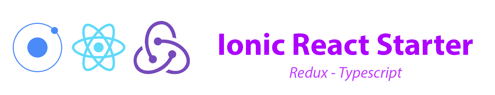

# 

Example stater code for creating cross platform (android/ios/web) by Ionic framework and ReactJs.
The source codes using Typescript as the language and Redux architecture
Contains API Request architecture by Axios, theming by Material UI


## Tech stack
- Application Scaffolding: [React boilerplate](https://www.reactboilerplate.com/)
- Module Bundler: [Webpack](https://webpack.js.org/)
- Hybrid Application Framework: [Ionic framework](https://ionicframework.com/)
- Application Framework: [React js](https://reactjs.org/) / [Redux](https://redux.js.org/)
- Language: [TypeScript](https://www.typescriptlang.org/)
- UI Framework: [Material UI](https://material-ui.com/)
- Dependency Management: [NPM](https://www.npmjs.com)
- Deployment: [Amazon](https://aws.amazon.com/)
- Continuous Integration: [GitlabCI](https://gitlab.com)
- API Request: [Axios](https://github.com/axios/axios)

## Setup
```sh
npm install
```

## Build
```sh
bash build.sh <env> <platform>
```
- env: prod|dev|local (default: local)
- platform: ios|android|browser (default: browser)
For example:
To build ios with server production: `bash build.sh prod ios`

## Start
```sh
npm run start
```

## Clean
```sh
npm run clean:all
```

## Generate code
- Generate component: `npm run generate component <name>`
- Generate container: `npm run generate container <name>`